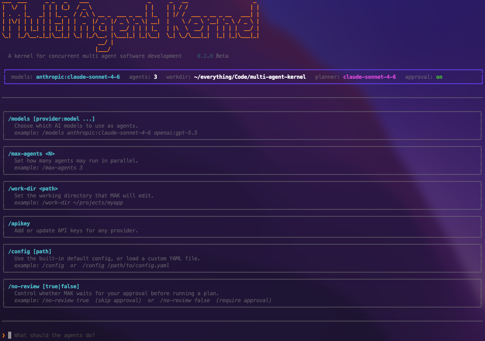

<div align="center">

# Multi Agent Kernel (MAK)


 
 
 


---

</br>

A kernel for **concurrent** multi-agent software development. 

Multiple agents edit one shared working directory at the same time.

No worktrees, no merge step, no late-stage reconciliation.

The Multi Agent Kernel arbitrates concurrent access the way an OS
arbitrates shared memory between threads.

</div>

</br>


## The idea

Most multi-agent coding systems give each agent a Git branch and merge at the end. A **message-passing** model where conflicts surface late, after the dependency
information needed to resolve them is gone.

The Multi Agent Kernel takes the **shared-memory** approach. 

- The codebase is decomposed into
independently lockable `AST nodes` (functions, methods, classes, headers). 

- Files on
disk are derived artifacts reconstructed from a `versioned node store`.

- The kernel owns a `symbol-level lock table` and resolves conflicts at *scheduling* time, where the
dependency graph is still explicit. 

- Each agent receives only the nodes it holds write
locks on, edits them in isolation, and returns the modified fragments. The kernel
reassembles the file.

> Check out the [knowledge graph](https://mak-kg.vercel.app) for this project. (created with [graphify](https://github.com/safishamsi/graphify))

## Run

> ⚠️ ***Currently, MAK only supports Python codebases***, there are plans to add other language support in the near future.

### CLI App

#### 1. Clone from source (Python ≥ 3.11)

```bash
git clone https://github.com/chaseungjoon/multi-agent-kernel
cd multi-agent-kernel
python3 -m venv .venv && source .venv/bin/activate
pip install -e .
```

#### 2. Run app from terminal

```bash
./bin/mak
```



**Features**

* Set api keys of providers you will use with `/apikey` command.
* Set working directory for MAK with `/work-dir <path>`
* Set models with `/models anthropic:claude-sonnet-4-6`
* Set number of agents with `/max-agents 3`
* Use default config or point to a custom config path with `/config` or `/config /path/to/config`
* Omit user review of planner with `/no-review true` (default false, not recommended to turn on)

---

### CLI Command


#### 1. Clone from source (Python ≥ 3.11)

```bash
git clone https://github.com/chaseungjoon/multi-agent-kernel
cd multi-agent-kernel
python3 -m venv .venv && source .venv/bin/activate
pip install -e .
```

#### 2. Set the API keys

Currently, MAK drives hosted models from **three providers — Anthropic, OpenAI, and Google
Gemini**. 

Put the key(s) for the providers you'll use in `mak/.env`.
You only need keys for the agents you actually run:

```bash
cp mak/.env.example mak/.env     # Fill in your keys 
```

#### 3. Choose the number and types of agents & Run

> ***⚠️ Just to be safe, create a separate branch for MAK to work on***

```bash
# Example with claude 4.8, gpt 5.5 and gemini 3 pro
python3 -m mak --task "your task" --work-dir /path/to/project \
  --models anthropic:claude-opus-4-8 openai:gpt-5.5 gemini:gemini-3-pro

# Example with claude 4.6 X 5
python3 -m mak --task "your task" --work-dir /path/to/project \
  --models anthropic --max-agents 5
```

**Command line arguments**
```bash
# Describe task
--task "Describe your task here"

# Set working directory
--work-dir /path/to/project

# Omit human review (Not recommended)
--no-review

# Default model
--models anthropic
--models openai
--models gemini

# Set model
--models anthropic:claude-opus-4-8
--models openai:gpt-5.4
--models gemini:gemini-3-pro

# Use multiple providers
--models anthropic openai gemini
--models anthropic:claude-opus-4-8 openai:gpt-5.5 gemini:gemini-3-pro

# Use single provider with multiple agents
--models anthropic --max-agents 5 
--models anthropic:claude-opus-4-8 --max-agents 3

# Choose a custom config file
--config /path/to/config.yaml

```

**[Default models list for each provider](mak/config.yaml)**


## Benchmark

[`benchmark/`](benchmark/) pits MAK against a traditional git-worktree multi-agent workflow on
the same workload with the same agents (3× `claude-sonnet-4-6`). Every operation **must
edit one shared registry function**. The numbers below are the **mean of 10 independent runs**

- [`benchmark/project_template_2/`](benchmark/project_template_2/) — 90 operations, 9 modules

  | | MAK | Git worktrees |
  |---|---|---|
  | Avg. Tokens | **18,339** | 23,760 |
  | Avg. Time | 226.5s | **99.5s** |
  | Avg. Accuracy | **94%** (253.1/270) | 93% (251.6/270) |
  | Avg. Merge conflicts | **0** | 2 |

> MAK spends **23% fewer tokens** and hits **zero merge conflicts** by construction. It also has a slight edge in accuracy.
>
> [More statistics](/benchmark/STATS.md)

Both sides got a few of the harder algorithms wrong, but the worktree side
additionally resulted in **2 merge conflicts.**

MAK is **slower** than traditional worktree based operations because every task contends on that one symbol, so MAK
serializes those writes while the worktrees edit in parallel and reconcile afterward: the
trade is **correctness by construction** and **token efficiency** for execution time on a deliberately
maximally-contended workload. 

Run it yourself (all targets) with

```bash
python3 benchmark/run_benchmark.py --mode real \
  --models anthropic --max-agents 3
```

## Contribute

[**CONTRIBUTING.md**](CONTRIBUTING.md) is the full guide — architecture, every
subsystem in depth, setup, the quality gates, coding standards, and where to help.

## License

[MIT](LICENSE) © 2026 Seungjoon Cha
