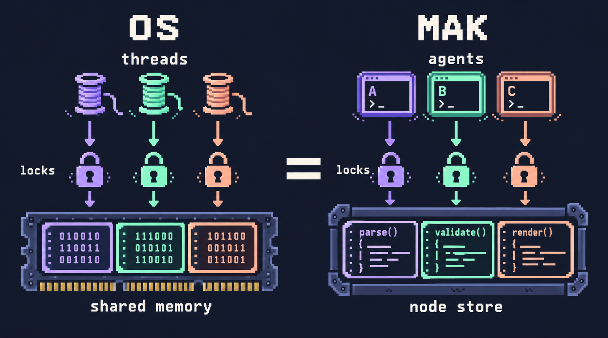
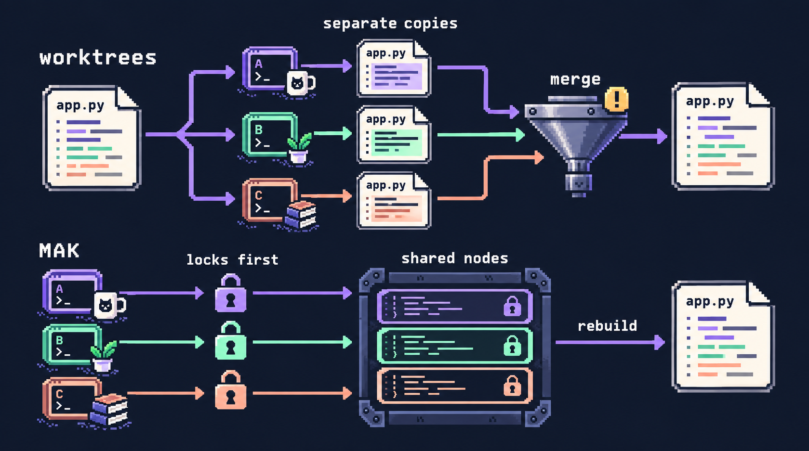
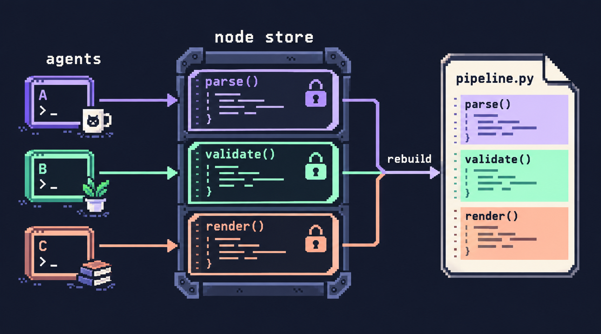
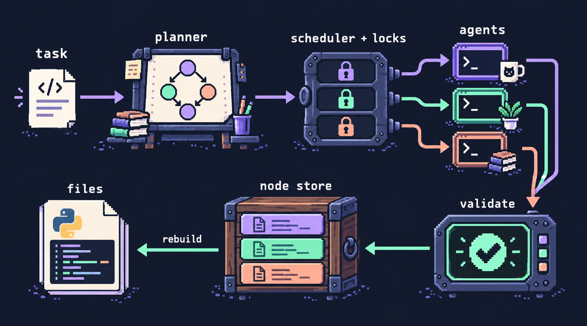

<div align="center">

# Multi Agent Kernel (MAK)


 
 
 

---

</br>

A kernel for **concurrent** multi-agent python software development.

Multiple agents edit one shared working directory at the same time.

No worktrees, no merge step, no late-stage reconciliation.

The Multi Agent Kernel arbitrates concurrent access the way an OS
arbitrates shared memory between threads.



</div>

</br>

## Table of Contents

- [The Idea](#the-idea)
- [Install](#install)
- [Update](#update)
- [Run](#run)
  - [CLI App](#cli-app)
  - [CLI Command](#cli-command)
- [Local Models](#local-models)
- [Configuration & API Keys](#configuration--api-keys)
- [Benchmark](#benchmark)
- [Contribute](#contribute)
- [License](#license)

## The Idea

### Traditional

Traditional **multi-agent coding systems** give each agent a Git branch and merge at the end —
a **message-passing** model where conflicts surface late, after the dependency
information needed to resolve them is gone.



### Multi-Agent Kernel

**MAK** takes the **shared-memory** approach instead: the codebase is decomposed into
independently lockable `AST nodes` (functions, methods, classes, headers), making it possible for multiple agents to edit the same file at the same time.

Files
on disk are derived artifacts reconstructed from a `versioned node store`. A `symbol-level lock table` resolves conflicts at ***scheduling*** time, while the
dependency graph is still explicit, so each agent edits only the nodes it holds
write locks on and the kernel reassembles the file. 



### Waves

> The planner is prompted to organizes jobs into **Waves**, maximizing parallelism by grouping jobs that can run concurrently without competing for write locks on the same AST nodes.

Before dispatching the agents, the planner's proposed
plan is cross-checked against the dependency graph. After a
wave, MAK re-checks what it left behind and offers any fix-ups as another
reviewable plan.




See [CONTRIBUTING.md](CONTRIBUTING.md) for the full architecture, or the
[diagrams](diagram/).

## Install

> Prerequisites: **Python ≥ 3.11**, **[uv](https://docs.astral.sh/uv/) (or [pipx](https://github.com/pypa/pipx))**, **git**

**uv (Recommended)**
```bash
uv tool install git+https://github.com/chaseungjoon/multi-agent-kernel
```

**pipx**
```bash
pipx install git+https://github.com/chaseungjoon/multi-agent-kernel
```

```bash
mak --version
```

<details>
<summary><b>From source</b> (for contributors)</summary>

```bash
git clone https://github.com/chaseungjoon/multi-agent-kernel
cd multi-agent-kernel
python3 -m venv .venv && source .venv/bin/activate
pip install -e .

# Run binary
./bin/mak
```

</details>

## Update

> ⚠️ The update feature is only supported for ***uv*** installs.

```bash
mak update
```

`mak update` moves to the newest **published release tag**.  Until this repo publishes its first tag, `mak update` falls back to
the tip of `main`.

## Run

> ⚠️ ***Currently, MAK only supports Python codebases***, there are plans to add other language support in the near future.

### CLI App

Launch the interactive app from any directory:

```bash
mak
```


**Features**

> Type `/` to browse all commands with one-line descriptions. (Tab autocomplete)
>
> `/help` lists commands and shortcuts.

* `/status` - Live session status (models, planner, agents, workdir, approval, tokens)
* `/apikey` - Set api keys of providers
* `/work-dir <path>` - Set working directory
* `/models <provider-1>:<model> <provider-2>:<model> ...` - Set agent models
* `/planner <provider>:<model>` - Set planner model
* `/refresh-models` - Re-fetch the model list from each provider right now
* `/local` - Overview of this machine's runtimes and connected remote hosts; `/local url <host:port>` connects (and remembers) one (see [Local Models](#local-models))
* `/mode [cloud|local|hybrid]` - Show or switch how this session gets its models
* `/max-agents <int>` - Set number of concurrently running agents
* `/config` - Returns to auto-discovery (see [Configuration & API Keys](#configuration--api-keys))
* `/config /path/to/config.yaml` - Point to a custom config
* `/no-review true` - Omit user review of planner
* `/clear` - clears the screen, `/exit` (or `/quit`, Ctrl+C) quits, Ctrl+J inserts a newline for multi-line tasks.

---

### CLI Command

For scripted / non-interactive runs, use `mak run` (equivalently `python3 -m mak`
in a source checkout). Set your API keys first — see
[Configuration & API Keys](#configuration--api-keys). You only need keys for the
agents you actually run.

> ***⚠️ MAK is still in beta. So just to be safe, create a separate branch for MAK to work on***

```bash
# Example with claude opus 5, gpt-5.6 sol and gemini 3.5 flash
mak run --task "your task" --work-dir /path/to/project \
  --models anthropic:claude-opus-5 openai:gpt-5.6-sol gemini:gemini-3.5-flash

# Example with claude sonnet 5 X 5 (provider default model)
mak run --task "your task" --work-dir /path/to/project \
  --models anthropic --max-agents 5
```

**Command line arguments**

```bash
# Describe task
--task "Describe your task here"

# Set working directory
--work-dir /path/to/project

# Omit human review (Not recommended)
--no-review

# Resume a crashed run from .mak/task_graph.json (no --task needed)
--recover

# Default model
--models anthropic
--models openai
--models gemini

# Set model
--models anthropic:claude-opus-5
--models openai:gpt-5.6-terra
--models gemini:gemini-3.1-pro-preview

# Use multiple providers (tasks are distributed round-robin across them)
--models anthropic openai gemini
--models anthropic:claude-opus-5 openai:gpt-5.6-sol gemini:gemini-3.5-flash

# Use single provider with multiple agents
--models anthropic --max-agents 5 
--models anthropic:claude-opus-5 --max-agents 3

# Local models — no API key needed (see Local Models below)
--models ollama:qwen2.5-coder:14b
--models local:my-model@http://localhost:8000/v1

# Choose a custom config file (default: auto-discovered, see below)
--config /path/to/config.yaml

```

**[Default models list for each provider](mak/config.yaml)** — kept current
automatically: MAK re-fetches each provider's model list in the background twice a
month (1st and 15th), so new models show up in `/models` and `/planner` without an
update. Run `/refresh-models` to fetch immediately instead of waiting.

> **Note on `claude-fable-5` and `claude-fable-5-1`:** MAK supports Anthropic's most capable model, but it
> comes with caveats — it requires an org with **30-day data retention** (zero-data-retention
> orgs get a 400 on every request), and it can decline requests with a `refusal` stop reason
> (which MAK treats as a failed task).

## Local Models

MAK supports local LLMs via an OpenAI-compatible server.

```bash
mak       #  choose "local" at first-run setup, or /local url http://host:port
```

Or non-interactively:

```bash
mak examples local-ollama > mak.yaml   # a ready-to-run config for Ollama
mak run --task "your task" --work-dir /path/to/project

# or point directly at a runtime, no config file needed
mak run --task "your task" --work-dir /path/to/project \
  --models ollama:qwen2.5-coder:14b
```

`ollama:<model>` talks to [Ollama](https://ollama.com)'s native API and defaults
to `http://localhost:11434`; `local:<model>@<url>` talks to any
OpenAI-compatible server (vLLM, LM Studio, llama.cpp) at an explicit endpoint.


MAK also sizes the model's context window for you and refuses a bundle that
would not fit, rather than letting it be silently truncated into a wrong
answer. 

If your local model plans worse than it edits, pair it with a hosted
planner — `mak.yaml` naming a cloud `planner.model` beside local `agents:` — the
first-run local setup recommends this automatically for smaller models. 

See
[mak/examples/](mak/examples/) for ready-made configs and [CONTRIBUTING.md §7.7/§14](CONTRIBUTING.md) for
the full detail.

## Configuration & API Keys

> MAK drives hosted models from **three providers — Anthropic, OpenAI,
and Google Gemini**. 

Keys are read from the environment
(`ANTHROPIC_API_KEY`, `OPENAI_API_KEY`, `GEMINI_API_KEY`) or from
`~/.config/mak/.env`.

The TUI's `/apikey` command (and its first-run setup)
writes them there for you, creating the file readable only by you.
Exported environment variables always win.

> When `--config` (or `/config`) is not given, MAK auto-discovers
its configuration, first match wins:

1. `./mak.yaml` — a per-project config in the current directory
2. `~/.config/mak/config.yaml` (respects `$XDG_CONFIG_HOME`) — your user default
3. The built-in default shipped with the package ([view it](mak/config.yaml))

To customize, copy the built-in default to either location and edit it.


**Capping what a run costs.** Nothing bounds a run's spend by default: retries,
iterations, and cascade waves multiply out. Set `session.max_total_tokens` to cap
it

```yaml
session:
  max_total_tokens: 2000000   # unset (the default) is unbounded
```

**One MAK per project.** A session takes an exclusive lease on the project's `.mak/`
before it touches anything, so a second `mak` on the same checkout fails
immediately.

## Benchmark

[`benchmark/`](benchmark/) pits MAK against a traditional git-worktree multi-agent workflow on
the same workload with the same agents.

- **Real world scenario** [`benchmark/project_template_3/`](benchmark/project_template_3/) — 58 tasks

  | | MAK | Traditional |
  |---|---|---|
  | Avg. Tokens | **13,911** | 16,291 |
  | Avg. Time | **57.07s** | 74.12s |
  | Avg. Accuracy | **75%** (111.4/148) | 63% (93.7/148) |
  | Avg. Merge conflicts | **0** | 4 |

- **Worst case scenario for MAK** [`benchmark/project_template_2/`](benchmark/project_template_2/) —  90 operations, 9 modules

  | | MAK | Traditional |
  |---|---|---|
  | Avg. Tokens | **18,339** | 23,760 |
  | Avg. Time | 226.5s | **99.5s** |
  | Avg. Accuracy | **94%** (253.1/270) | 93% (251.6/270) |
  | Avg. Merge conflicts | **0** | 2 |

> [More statistics](/benchmark/STATS.md)

### Tokens & Accuracy

- MAK spends **15%~23% fewer tokens** and hits **zero merge conflicts** by construction. It also has a notable edge (up to **19%** more) in accuracy.

### Time

- For **real-world situations** (`project_template_3`), where contention is spread out over the codebase, MAK is by design **faster** than Traditional operations.

- In a **worst case scenario** (`project_template_2`), where tasks contend to **one symbol**, MAK can be **more than 2 times slower** than Traditional operations.

### Reproduce results

```bash
python3 benchmark/run_benchmark.py --mode real \
  --models anthropic:claude-opus-5 --max-agents 3
```

## Contribute

[**CONTRIBUTING.md**](CONTRIBUTING.md) is the full guide — architecture, every
subsystem in depth, setup, the quality gates, coding standards, and where to help.

Everyone participating in this project is expected to follow the
[Code of Conduct](CODE_OF_CONDUCT.md).

## License

[MIT](LICENSE) © 2026 Seungjoon Cha
