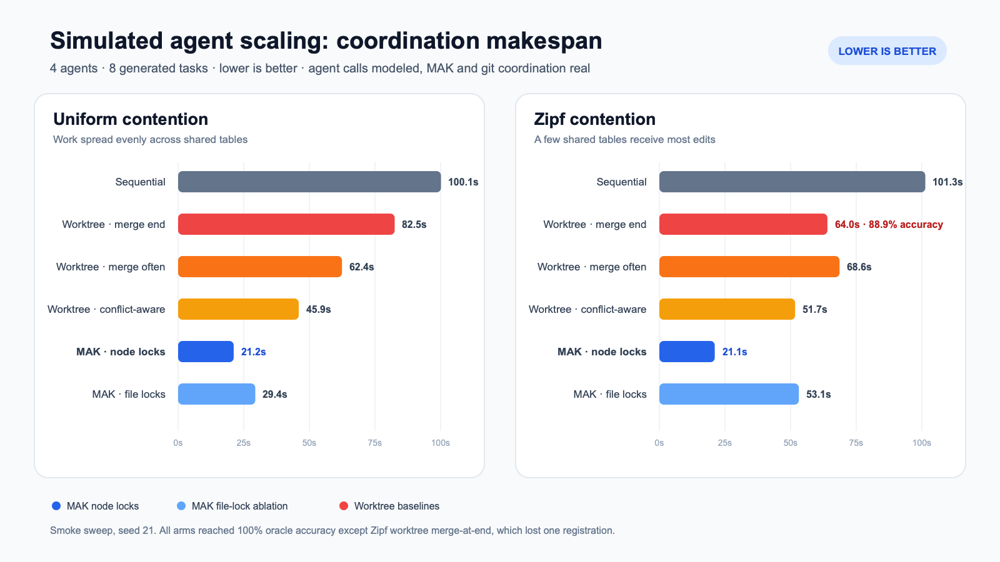
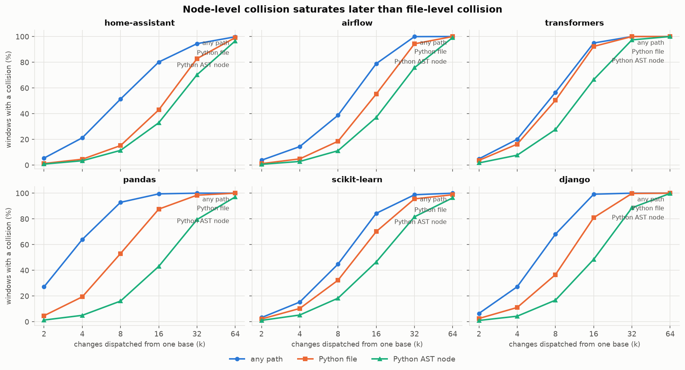

<div align="center">

# Multi Agent Kernel (MAK)


 
 
 

---

</br>

A kernel for **concurrent** multi-agent python software development.

Multiple agents edit one shared working directory at the same time.

No worktrees, no merge step, no late-stage reconciliation.

The Multi Agent Kernel arbitrates concurrent access the way an OS
arbitrates shared memory between threads.

</div>

</br>

## Table of Contents

- [The Idea](#the-idea)
- [Install](#install)
- [Update](#update)
- [Run](#run)
  - [CLI App](#cli-app)
  - [CLI Command](#cli-command)
- [Configuration](#configuration)
  - [Cloud Models](#cloud-models)
  - [Local Models](#local-models)
- [Benchmark](#benchmark)
  - [Real Model Benchmark](#real-model-benchmark)
  - [Simulated Scaling Benchmark](#simulated-scaling-benchmark)
- [Real-life Contention Study](#real-life-contention-study)
- [Contribute](#contribute)
- [License](#license)

## The Idea

### Traditional

Traditional **multi-agent coding systems** give each agent a Git branch and merge at the end —
a **message-passing** model where conflicts surface late, after the dependency
information needed to resolve them is gone.


### Multi-Agent Kernel

**MAK** takes the **shared-memory** approach instead: the codebase is decomposed into
independently lockable `AST nodes` (functions, methods, classes, headers), making it possible for multiple agents to edit the same file at the same time.

Files
on disk are derived artifacts reconstructed from a `versioned node store`. A `symbol-level lock table` resolves conflicts at ***scheduling*** time, while the
dependency graph is still explicit, so each agent edits only the nodes it holds
write locks on and the kernel reassembles the file. 


### Waves

> The planner is prompted to organizes jobs into **Waves**, maximizing parallelism by grouping jobs that can run concurrently without competing for write locks on the same AST nodes.

Before dispatching the agents, the planner's proposed
plan is cross-checked against the dependency graph. After a
wave, MAK re-checks what it left behind and offers any fix-ups as another
reviewable plan. Generated repairs carry kernel-owned postconditions: MAK checks
the prospective repository before committing them, and stops instead of asking
again when a repair makes no progress or revisits an earlier broken state.


See [CONTRIBUTING.md](CONTRIBUTING.md) for the full architecture, or the
[diagrams](diagram/).

## Install

> Prerequisites: **Python ≥ 3.11**, **[uv](https://docs.astral.sh/uv/) (or [pipx](https://github.com/pypa/pipx))**, **git**

**uv (Recommended)**
```bash
uv tool install git+https://github.com/chaseungjoon/multi-agent-kernel
```

**pipx**
```bash
pipx install git+https://github.com/chaseungjoon/multi-agent-kernel
```

```bash
mak --version
```

<details>
<summary><b>From source</b> (for contributors)</summary>

```bash
git clone https://github.com/chaseungjoon/multi-agent-kernel
cd multi-agent-kernel
python3 -m venv .venv && source .venv/bin/activate
pip install -e .

# Run binary
./bin/mak
```

</details>

## Update

> ⚠️ The update feature is only supported for ***uv*** installs.

```bash
mak update
```

`mak update` moves to the newest **published release tag**.  Until this repo publishes its first tag, `mak update` falls back to
the tip of `main`.

## Run

> ⚠️ ***Currently, MAK only supports Python codebases***, there are plans to add other language support in the near future.

### CLI App

Launch the interactive app from any directory:

```bash
mak
```


**Features**

> Type `/` to browse all commands with one-line descriptions. (Tab autocomplete)
>
> `/help` lists commands and shortcuts.

* `/status` - Live session status (models, planner, agents, workdir, approval, tokens)
* `/apikey` - Set api keys of providers
* `/work-dir <path>` - Set working directory
* `/models <provider-1>:<model> <provider-2>:<model> ...` - Set agent models
* `/planner <provider>:<model>` - Set planner model, same `provider:model` format as `/models` (e.g. `/planner anthropic:claude-opus-5`, `/planner openrouter:anthropic/claude-opus-5`, `/planner ollama:qwen2.5-coder:14b`)
* `/refresh-models` - Re-fetch the model list from each provider right now
* `/local` - Overview of this machine's runtimes and connected remote hosts; `/local url <host:port>` connects (and remembers) one (see [Local Models](#local-models))
* `/mode [cloud|local|hybrid]` - Show or switch how this session gets its models
* `/max-agents <int>` - Set number of concurrently running agents
* `/config` - Returns to auto-discovery from the work dir (see [Configuration and API keys](#configuration-and-api-keys))
* `/config /path/to/config.yaml` - Point to a custom config
* `/no-review true` - Omit user review of planner
* `/clear` - clears the screen, `/exit` (or `/quit`, Ctrl+C) quits, Ctrl+J inserts a newline for multi-line tasks.

---

### CLI Command

For scripted / non-interactive runs, use `mak run` (equivalently `python3 -m mak`
in a source checkout). Set your API keys first — see [Cloud Models](#cloud-models).
You only need keys for the agents you actually run.

> ***⚠️ MAK is still in beta. So just to be safe, create a separate branch for MAK to work on***

```bash
# Example with claude opus 5, gpt-5.6 sol and gemini 3.5 flash
mak run --task "your task" --work-dir /path/to/project \
  --models anthropic:claude-opus-5 openai:gpt-5.6-sol gemini:gemini-3.5-flash

# Example with claude sonnet 5 X 5 (provider default model)
mak run --task "your task" --work-dir /path/to/project \
  --models anthropic --max-agents 5

# Example with gpt-5.6 sol agents, planned by claude opus 5
mak run --task "your task" --work-dir /path/to/project \
  --models openai:gpt-5.6-sol --planner anthropic:claude-opus-5
```

**Command line arguments**

```bash
# Describe task
--task "Describe your task here"

# Set working directory
--work-dir /path/to/project

# Omit human review (Not recommended)
--no-review

# Resume a crashed run from .mak/task_graph.json (no --task needed)
--recover

# Default model
--models anthropic
--models openai
--models gemini

# Set model
--models anthropic:claude-opus-5
--models openai:gpt-5.6-terra
--models gemini:gemini-3.1-pro-preview

# Use multiple providers (tasks are distributed round-robin across them)
--models anthropic openai gemini
--models anthropic:claude-opus-5 openai:gpt-5.6-sol gemini:gemini-3.5-flash

# Use single provider with multiple agents
--models anthropic --max-agents 5 
--models anthropic:claude-opus-5 --max-agents 3

# Local models — no API key needed (see Local Models below)
--models ollama:qwen2.5-coder:14b
--models local:my-model@http://localhost:8000/v1

# Set planner model (same provider:model format as --models; model required)
--planner anthropic:claude-opus-5
--planner openrouter:anthropic/claude-opus-5
--planner ollama:qwen2.5-coder:14b

# Choose a custom config file (default: auto-discovered, see below)
--config /path/to/config.yaml

```

**[Default models list for each provider](mak/config.yaml)** — kept current
automatically: MAK re-fetches each provider's model list in the background twice a
month (1st and 15th), so new models show up in `/models` and `/planner` without an
update. Run `/refresh-models` to fetch immediately instead of waiting.

> **Note on `claude-fable-5` and `claude-fable-5-1`:** MAK supports Anthropic's most capable model, but it
> comes with caveats — it requires an org with **30-day data retention** (zero-data-retention
> orgs get a 400 on every request), and it can decline requests with a `refusal` stop reason
> (which MAK treats as a failed task).

## Configuration

Without `--config` or `/config`, MAK uses the first configuration it finds,
looking from the **work dir** (the project being edited: `--work-dir`,
`/work-dir`, or the directory you launched from):

1. `<work dir>/.mak/config.yaml` — this project's config
2. `~/.config/mak/config.yaml` (or `$XDG_CONFIG_HOME/mak/config.yaml`) — your
   user-level config

If neither exists, the built-in [default configuration](mak/config.yaml) is
used.

> ⚠️ Set `session.max_total_tokens` in `config.yaml` to cap a run's token
usage. ***The default is unlimited.***

### Cloud Models

#### Officially Supported Providers

> MAK officially supports Anthropic, OpenAI, Google Gemini.

Use `/apikey` during setup, or provide `ANTHROPIC_API_KEY`, `OPENAI_API_KEY`,
`GEMINI_API_KEY` key variable in the environment.

`~/.config/mak/.env` stores keys entered through MAK; exported variables take
precedence.

#### OpenAI-compatible and custom endpoints

Run `/endpoint add` to configure OpenRouter, NVIDIA Build, DeepSeek, Z.ai, or
any OpenAI Chat Completions-compatible service. 

MAK stores the endpoint in
`~/.config/mak/endpoints.json` and references its API key by environment
variable name, never by the key itself.

```bash
export OPENROUTER_API_KEY=...
mak run --task "your task" --work-dir /path/to/project \
  --models openrouter:meta/llama-3.3-70b-instruct
```

Use `/endpoint list`, `/endpoint test <id>`, `/endpoint models <id>`, or
`/endpoint export <id>` to manage endpoints. Templates are also available:

```bash
mkdir -p .mak
mak examples hosted-openai-compatible > .mak/config.yaml
mak examples custom-endpoint > .mak/config.yaml
```

MAK automatically adapts its response format to each model's capabilities.

### Local Models

MAK supports Ollama and OpenAI-compatible local servers such as vLLM, LM
Studio, and llama.cpp. Choose `local` during setup or connect with
`/local url http://host:port`.

```bash
# Ollama defaults to http://localhost:11434
mak run --task "your task" --work-dir /path/to/project \
  --models ollama:qwen2.5-coder:14b

# Any OpenAI-compatible local server
mak run --task "your task" --work-dir /path/to/project \
  --models local:my-model@http://localhost:8000/v1
```

For a ready-made configuration, run
`mkdir -p .mak && mak examples local-ollama > .mak/config.yaml`.
Local agents can also use a cloud planner (e.g. `--planner anthropic:claude-opus-5`). See [mak/examples/](mak/examples/)
for more configurations.

## Benchmark

MAK has two complementary benchmark suites. The **real-model suite** measures
end-to-end coding quality and cost on fixed projects. The **simulated suite** holds
agent behavior constant to measure coordination as contention changes.

### Real-model benchmark

> Both workflows receive the same workload, models, and task assignments.

#### Partially contended workload

[`project_template_3`](benchmark/project_template_3/) — 58 tasks

| | MAK | Traditional |
|---|---|---|
| Avg. Tokens | **13,911** | 16,291 |
| Avg. Time | **57.07s** | 74.12s |
| Avg. Accuracy | **75%** (111.4/148) | 63% (93.7/148) |
| Avg. Merge conflicts | **0** | 4 |

#### Single-hot-symbol stress test

[`project_template_2`](benchmark/project_template_2/) — 90 operations across 9 modules

| | MAK | Traditional |
|---|---|---|
| Avg. Tokens | **18,339** | 23,760 |
| Avg. Time | 226.5s | **99.5s** |
| Avg. Accuracy | **94%** (253.1/270) | 93% (251.6/270) |
| Avg. Merge conflicts | **0** | 2 |

MAK used **15–23% fewer tokens** and avoided merge conflicts in both workloads. It
was faster when contention was spread across the project, but slower when every
task targeted one symbol, which is a limitation by design.

### Simulated scaling benchmark



The keyless smoke sweep uses real MAK coordination and real Git worktrees and
merges; only agent latency, token use, correctness, and conflict resolution are
modeled.

With four agents, node-level MAK finished in about **21 seconds under**
both contention shapes. File-level locking rose to 29 seconds for uniform and
53 seconds for [Zipf contention](https://en.wikipedia.org/wiki/Zipf%27s_law), while merge-at-end lost one Zipf registration.

### Reproduce results

```bash
# Real-model benchmark
python3 benchmark/run_benchmark.py --mode real \
  --models anthropic:claude-opus-5 --agents 3

# Keyless simulated smoke sweep
python3 benchmark/sweep.py --config benchmark/sweeps/smoke.yaml --fresh
```

[Benchmark details](benchmark/README.md) · [Real-model statistics](benchmark/STATS.md) ·
[Scaling verdicts](benchmark/sim/RESULTS.md)

## Real-life Contention Study

[contention_study](research/contention_study) mined six Python repositories to compare concurrent file and AST-node
contention in real-life open source systems. 

Python-node collisions were **2.2–10.3× less frequent** than
Python-file collisions. 

All **5,316 shared-node pairs** merged cleanly, and no
shallow static defect appeared in **2,400 clean merges**.



[Full study](research/contention_study/CONTENTION_STUDY.md) ·
[Results tables](research/contention_study/data/RESULTS.md) ·
[Dataset documentation](research/contention_study/DATASHEET.md)

## Contribute

[**CONTRIBUTING.md**](CONTRIBUTING.md) is the full guide — architecture, every
subsystem in depth, setup, the quality gates, coding standards, and where to help.

Everyone participating in this project is expected to follow the
[Code of Conduct](CODE_OF_CONDUCT.md).

## License

[MIT](LICENSE) © 2026 Seungjoon Cha
