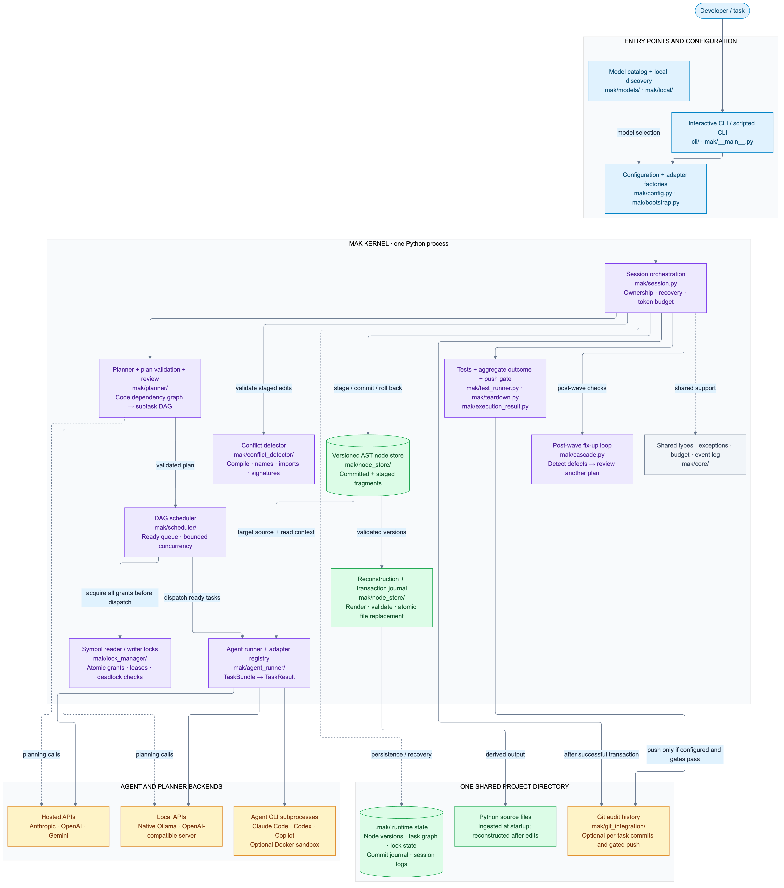
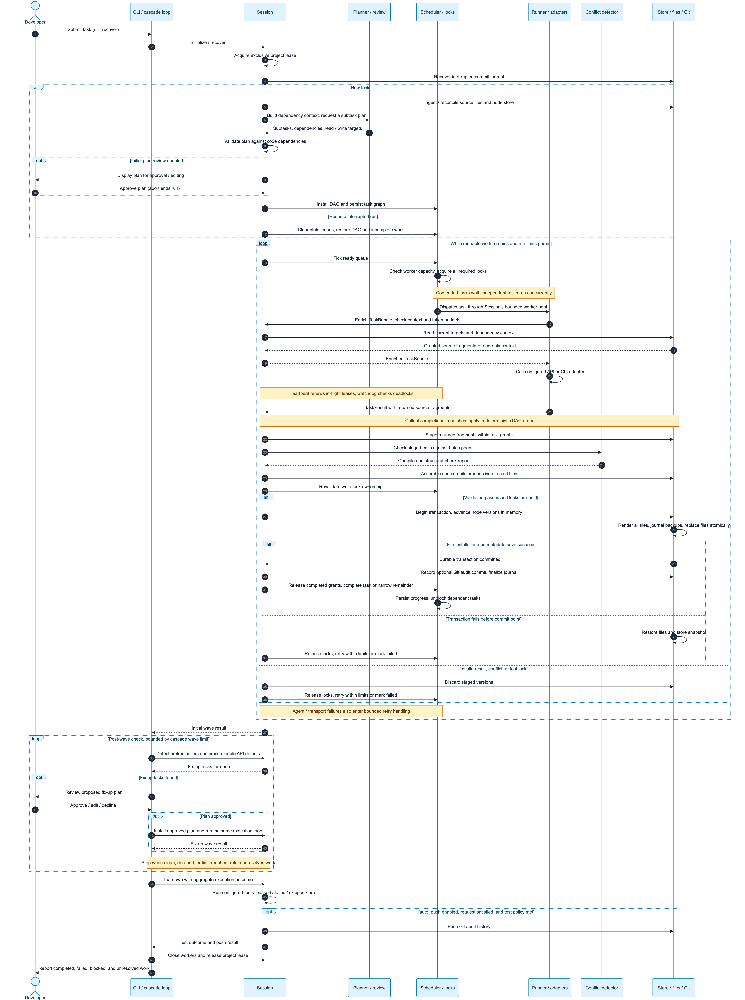

# Project diagrams

Two views of the implemented MAK runtime. The `.mmd` files are editable Mermaid
sources; the `.png` files are rendered exports using `mermaid_config.json`.

| Diagram | Mermaid source | PNG |
|---|---|---|
| Component architecture | [architecture.mmd](architecture.mmd) | [architecture.png](architecture.png) |
| Execution sequence | [execution_sequence.mmd](execution_sequence.mmd) | [execution_sequence.png](execution_sequence.png) |

## Component architecture

Shows the entry points, kernel subsystems, agent and planner backends, and shared
project storage. Solid arrows indicate calls or data flow; dotted arrows indicate
supporting relationships. Boxes group related modules rather than separate
services. `tests/`, `benchmark/`, and `demo/` exercise this runtime and are not
runtime components.



## Execution sequence

Shows initialization or recovery, planning, concurrent dispatch, ordered result
validation, transactional file installation, retries, fix-up waves, and teardown.
Participants combine closely related components to keep the sequence readable.
Independent agent calls overlap; commits are applied serially in deterministic
order. Partial results commit completed grants and re-dispatch only remaining work.

Initial plan review is configurable. Cascade approval is supplied by the front
end; the scripted CLI declines cascade waves under `--no-review`. A declined or
exhausted cascade remains part of the aggregate result. Git commits and pushes
are configurable, and push requires a satisfied aggregate result plus the test
policy (`require_pass` by default; `allow_skip` also permits a skipped suite).



## Regenerate the PNGs

From the repository root, with Node.js available (exports rendered with Mermaid
CLI 11.17.0; the architecture uses its ELK layout):

```sh
npx --package @mermaid-js/mermaid-cli@11.17.0 mmdc -i diagram/architecture.mmd -o diagram/architecture.png -c diagram/mermaid_config.json -b white -w 2400 -s 2
npx --package @mermaid-js/mermaid-cli@11.17.0 mmdc -i diagram/execution_sequence.mmd -o diagram/execution_sequence.png -c diagram/mermaid_config.json -b white -w 2400 -s 2
```

To use an existing Chrome installation, add `-p /path/to/puppeteer-config.json`
with a JSON object containing an `executablePath` pointing to Chrome. Rendering
tools are documentation tooling; they are not Python runtime dependencies.

The diagrams were checked against `mak/session.py`, `mak/scheduler/scheduler.py`,
`mak/agent_runner/runner.py`, `mak/node_store/transaction.py`, `mak/bootstrap.py`,
`mak/cascade.py`, `mak/teardown.py`, and the CLI entry points.
