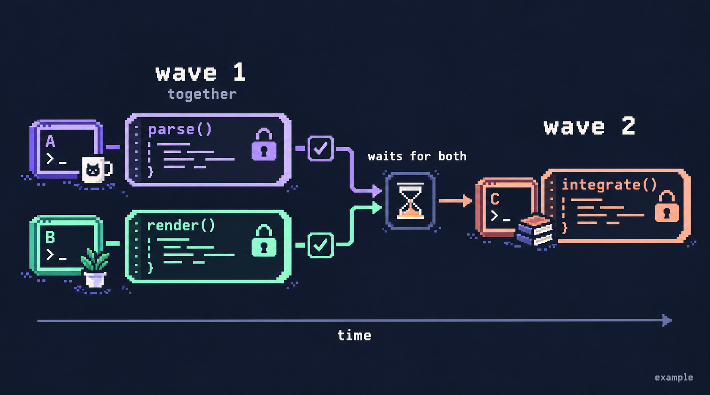

# MAK, illustrated

### Same file, different symbols

Agents hold separate write grants; the kernel rebuilds the file from the node store.

### Inspired by shared memory

Threads share protected memory. MAK applies that idea to agents and source nodes.

### Inside the kernel

The simplified path of an accepted edit, from planning to reconstructed files.

### Worktrees versus shared nodes

Separate copies merge later; MAK coordinates access before edits.

### Work in waves

Independent tasks run together; a dependent task waits for both results.

[Full-width preview](index.html) · [Generation prompts](prompts/)

Built with the built-in image-generation tool. Based on the repository's architecture, scheduler, lock rules, and node-store documentation. These are conceptual illustrations: validation and file reconstruction participate in a transaction; review, retries, recovery, and Git auditing are omitted from the overview.
